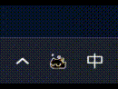
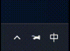

<div align="center">


# RunCat

**一只在系统托盘奔跑的小猫，Rust 驱动。**

[English](README.md) | 中文

[](https://github.com/LuXv233/RunCat-rust/stargazers)
[](https://github.com/LuXv233/RunCat-rust/network)
[](https://github.com/LuXv233/RunCat-rust/issues)
[](https://github.com/LuXv233/RunCat-rust/blob/main/LICENSE)
[](https://github.com/LuXv233/RunCat-rust/releases)
[](https://github.com/LuXv233/RunCat-rust/releases)

</div>

---

RunCat-rust 是 [RunCat365](https://github.com/Kyome22/RunCat365) 的 Rust 重新实现，将一只可爱的奔跑小猫带到你的 Windows 系统托盘中。小猫的速度会根据 CPU 占用实时变化 — 电脑越忙，它跑得越快。

## 演示

<div align="center">

| 气泡小猫 | 奔跑小猫 | 专注时间 |
|:---:|:---:|:---:|
|  |  |  |

</div>

## 功能

<table>
<tr>
<td width="50%">

### 系统托盘动画
一只奔跑的小猫住在你的系统托盘中，速度随 CPU 占用实时变化。

### 两种皮肤
- **BubbleKitten（气泡小猫）** — 10 帧可爱气泡风格小猫
- **RunCat（奔跑小猫）** — 5 帧经典奔跑小猫

### 颜色模式
- 跟随系统（自动深色/浅色）
- 深色模式
- 浅色模式

</td>
<td width="50%">

### 专注时间
浮动时钟，彩虹渐变文字（每秒 8° 色相旋转），完全透明且不影响鼠标操作。

### 编辑模式
可拖动时间窗口到屏幕任意位置，位置跨重启自动记忆。

### 开机自启
通过注册表实现开机自启，托盘菜单一键切换。

### 设置持久化
主题、皮肤、时间窗口显示状态及位置 — 全部自动保存与恢复。

</td>
</tr>
</table>

## 构建与运行

**环境要求：** [Rust](https://www.rust-lang.org/tools/install)（cargo）

```powershell
# 构建 Release 版本
cargo build --release

# 运行
.\target\release\run_cat.exe

# 或直接用 cargo 运行
cargo run --release
```

> 运行后会在系统托盘创建图标，请检查托盘区域。

## 使用说明

右键点击系统托盘中的小猫图标：

| 菜单 | 操作 |
|:---|:---|
| **颜色模式** | 切换 跟随系统 / 深色 / 浅色 |
| **宠物** | 切换 气泡小猫 / 奔跑小猫 |
| **显示 / 隐藏时间** | 开关浮动时间窗口 |
| **编辑模式** | 开关时间窗口拖动模式 |
| **开机自启** | 开关开机自动启动 |
| **退出** | 关闭程序 |

## 版权声明

美术资源（小猫动画、图标等）来源于原项目 [RunCat365](https://github.com/Kyome22/RunCat365)，版权归原作者所有。如果你是版权所有者并希望移除或修改相关内容，请提交 issue 或联系维护者。

## 致谢

感谢 [Kyome22 / RunCat365](https://github.com/Kyome22/RunCat365) 的原始设计与美术资源，本项目受其启发。

## 许可证

[Apache-2.0](LICENSE)
